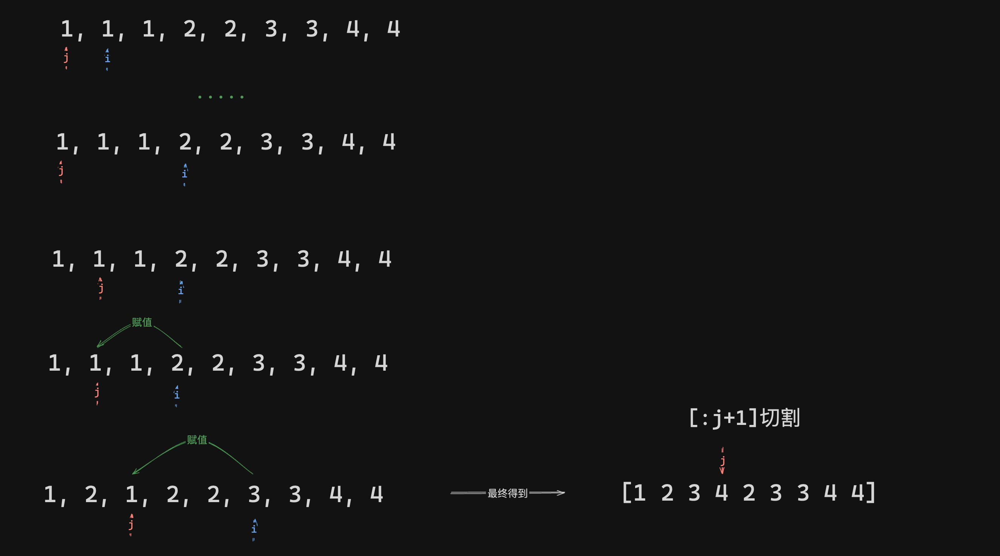

## 前言

本篇文章是根据Go官网的一个有趣的[Wiki](https://go.dev/wiki/SliceTricks)，Golang一直都是以简单著称的，如果你是一个Java选手，那么一定会给眼花缭乱的库所征服，会封装一切你能用到的方法。

这个图十分有趣（**Everything is 「for」**）


尽管Golang并没有给开发者封装太多的方法，反而是通过一些Tricks可以实现你想要达到的效果

> 这种设计仅仅是一种选择而已，并没有绝对的正确！

下面就来看看官方给介绍的一些Tricks吧

## Slice

大部分的时候使用slice都是和`append`和`copy`打交道，官方也是这样推荐的

### 基础使用

#### Copy复制

先来看看如果需要复制slice，可以使用什么方法

``` go
func main() {
  a := []int{1,2,3}
  b := make([]int, len(a))
  copy(b, a)
}
```

```go\
func main() {
  a := []int{1, 2, 3, 4, 5}
  b := append([]int(nil), a...)
	b1 := append(a[:0:0], a...)
	fmt.Println(b)
	fmt.Println(b1)
}
```

这两种方式有什么区别吗？

- `make + copy`：容量在初始化的时候定义了`len(a)`，所以说如果后续需要追加需要分配新的内存
- 而后面两种方式：因为它们通常会预留更大的容量，减少内存重新分配的次数。

> 如果没有额外的追加操作，或者追加的元素较少，make + copy 的性能可能更好。

#### Cut剪切

```go
a := []int{1, 2, 3, 4, 5}
b := []int{1, 2, 3}
c := append(a[:1], b[1:]...) // 1,2,3
```

#### Delete删除

万物皆可append+copy

```go
a := []int{1, 2, 3, 4, 5} // 删除2
a = append(a[:1], a[2:]...) // append
a = a[:1+copy(a[1:], a[2:])]

```

`a = a[:i+copy(a[i:], a[i+1:])]` 假设你需要删除的索引为`i`

- `a[i+1:]` 表示从索引i+1开始到切片尾部的部分
- 移动到`a[i:]`位置，**也就是覆盖索引`i`的值，所有后续的元素向前移动一个位置**
- `a[:i+copy(...)]`相当于将slice的长度缩短到`i + copy(...)`

---

> 注意：如果元素的类型为**指针**或者是**结构体**，因为需要进行垃圾回收，在Cut和Delete可能会出现内存泄露问题
>
> - 带有值的元素仍然被切片a的底层数组引用，代码层面上使用了delete方法进行删除，但是底层依旧被引用，如果底层数组的生命周期很长的话，那么表示出现了内存泄露

#### 解决指针或者结构体的Cut/Delete

Cut

1. 首先就是copy：将从索引j开始的元素移动到索引i到位置，以覆盖被删除的区间
2. 清理冗余元素，显示复制为nil，确保这些位置上不再引用原来的值
3. 缩短切片的长度

```go
copy(a[i:], a[j:])
for k, n := len(a)-j+i, len(a); k < n; k++ {
    a[k] = nil // or the zero value of T
}
a = a[:len(a)-j+i]
// =====================================
func main() {
    a := []*int{new(int), new(int), new(int), new(int), new(int)}
    *a[0], *a[1], *a[2], *a[3], *a[4] = 1, 2, 3, 4, 5

    i, j := 1, 3 // 删除索引区间 [1, 3) 的元素

    copy(a[i:], a[j:]) // 移动数据
    for k, n := len(a)-j+i, len(a); k < n; k++ {
        a[k] = nil // 设置为 nil
    }
    a = a[:len(a)-j+i] // 调整切片长度

    fmt.Println(a) // 输出: [1 4 5]
}
```

Delete

和Cut同理

```go
copy(a[i:], a[i+1:])
a[len(a)-1] = nil // or the zero value of T
a = a[:len(a)-1]
```

### 其他

#### 在位置i插入n个元素

`a = append(a[:i], append(make([]T, n), a[i:]...)...)`

```go
func main() {
    a := []int{1, 2, 3, 4}
    i := 2  // 插入位置
    n := 3  // 插入元素数量

    a = append(a[:i], append(make([]int, n), a[i:]...)...)

    fmt.Println(a) // 输出: [1 2 0 0 0 3 4]
}
```

如果插入的元素需要具体值，可以在make之后再赋值

```go
b := make([]int, n)
for i := range b {
  b[i] = 1013
}
a = append(a[:i], append(b, a[i:]...)...)
```

#### 添加n个元素

其实就是上面所用到的`a = append(a, make([]T, n)...)`

#### 扩展容量

确保有足够的空间来附加n个元素，无需重新分配

```go
if cap(a)-len(a) < n {
    a = append(make([]T, 0, len(a)+n), a...)
}
===========================================
a := []int{1, 2, 3}
n := 5 // 需要插入的元素个数

if cap(a)-len(a) < n {
	a = append(make([]int, 0, len(a)+n), a...)
}

fmt.Println(a)       // 输出: [1 2 3]
fmt.Println(cap(a))  // 输出: len(a) + n，即 8
```

这样的好处就是避免多次扩容，在Go中当发生自动扩容的时候，通常是2倍

#### 过滤原地

```go
n := 0
for _, x := range a {
    if check(x) {
        a[n] = x
        n++
    }
}
a = a[:n]
```

#### 插入

在slice的位置i插入一个元素x，`a = append(a[:i], append([]T{x}, a[i:]...)...)`

```go
func main() {
    a := []int{1, 2, 3, 4}
    i := 2
    x := 99

    a = append(a[:i], append([]int{x}, a[i:]...)...)
    fmt.Println(a) // 输出: [1 2 99 3 4]
}
```

简单的性能分析：

内存分配：`append([]T{x}, a[i:]...)` 分配了一个新的切片，存储插入的元素和插入位置后的元素。`append(a[:i], ...)` 分配了一个新的切片。因此一共分配了两个新的切片

第二个`append`创建的时候，有独自的底层存储的新slice，将`a[i:]`的元素复制到该slice中，再复制到第一个中。

如何避免创建新的slice呢？

```go
s = append(s, 0 /* use the zero value of the element type */)
copy(s[i+1:], s[i:])
s[i] = x
================================================
func main() {
    a := []int{1, 2, 3, 4}
    i := 2
    x := 99

    a = append(a, 0)         // 扩展切片容量
    copy(a[i+1:], a[i:])     // 将索引 i 之后的元素右移
    a[i] = x                 // 插入元素

    fmt.Println(a) // 输出: [1 2 99 3 4]
}
```

#### 常用操作

Push And Push Front/Unshift 增加元素

```go
a = append(a, x)
a = append([]T{x}, a...) // 向slice头部添加元素
```

Pop And Pop Front/Shift 弹出元素

```go
x, a = a[len(a)-1], a[:len(a)-1]
x, a = a[0], a[1:] // 弹出头部
```

## 其他Tricks

#### 不分配过滤

核心在于`b := a[:0]`slice与原始slice共享相同的backing array和capacity。

看一个🌰，遍历出slice中偶数

```go
func main() {
    a := []int{1, 2, 3, 4, 5, 6}

    b := a[:0] // 初始化 b，与 a 共享底层数组

    for _, x := range a {
        if x%2 == 0 { // 保留偶数
            b = append(b, x)
        }
    }

    fmt.Println("b:", b) // 输出: [2 4 6]
    fmt.Println("a:", a) // 输出: [2 4 6 4 5 6]，注意 a 的后面部分未清理
}
```

优点在于：不需要额外的分配新的切片，直接复用原切片。

需要注意的是：

1. 未清理的数组部分，过滤后「a的逻辑长度变短」但底层数组的其余部分保留了原始值
2. 如果元素类型是指针或者结构体，可能会导致内存泄漏的问题

> 过滤后「a的逻辑长度变短」
>
> 1. 逻辑长度指的是过滤后，切片中有效数据的个数。
>    - 虽然底层数组还包含所有原始数据，但你只会通过 b 访问过滤后的前 len(b) 个数据。
> 2. 原始切片 a 的“逻辑长度”相当于 b 的长度，因为 b 保存的是有效数据。

> 「内存泄漏的问题」
>
> 过滤操作并没有清除 a 的多余部分（len(b) 到 len(a) 之间的数据），这可能会导致内存泄漏问题，特别是当切片元素是指针或带有指针的复杂类型时。

```go
for i := len(b); i < len(a); i++ {
    a[i] = 0 // 或 nil，取决于类型 T 的零值
}
```

#### 翻转

在Golang中翻转slice应该如何做呢？相当于一个小算法，只需要遍历slice一半的元素，然后进行「对称」`opp := len(a) - i - 1 `，opp是索引`i`的对称

```go
func main() {
  for i := len(a)/2-1; i >= 0; i-- {
    opp := len(a)-1-i
    a[i], a[opp] = a[opp], a[i]
	}
}
```

还有最常见的双指针法

```glo
for left, right := 0, len(a)-1; left < right; left, right = left+1, right-1 {
    a[left], a[right] = a[right], a[left]
}
```

#### Fisher–Yates（现代洗牌算法）

具有等概率随机性

```go
for i := len(a) - 1; i > 0; i-- {
    j := rand.Intn(i + 1)
    a[i], a[j] = a[j], a[i]
}
```

#### 最小分配的批处理

当给了一个很大的slice数据，需要分批进行处理，那么这个算法就十分有用了

```tex
1.初始状态：
	actions = [0, 1, 2, 3, 4, 5, 6, 7, 8, 9]
	batches = []
2.第一次循环：
	提取批次：actions[0:3] = [0, 1, 2]
	更新：
	actions = [3, 4, 5, 6, 7, 8, 9]
	batches = [[0, 1, 2]]
3.第二次循环：
	提取批次：actions[0:3] = [3, 4, 5]
	更新：
	actions = [6, 7, 8, 9]
	batches = [[0, 1, 2], [3, 4, 5]]
```

```go
func main() {
  actions := []int{0, 1, 2, 3, 4, 5, 6, 7, 8, 9}
	batchSize := 3
	batches := make([][]int, 0, (len(actions)+batchSize-1)/batchSize)

	for batchSize < len(actions) {
		actions, batches = actions[batchSize:], append(batches, actions[0:batchSize:batchSize])
	}
	batches = append(batches, actions)
	fmt.Println(batches)
}
```

#### 去重

看图！


```go
in := []int{3, 2, 1, 4, 3, 2, 1, 4, 1} // any item can be sorted
sort.Ints(in)
j := 0
for i := 1; i < len(in); i++ {
    if in[j] == in[i] {
       continue
    }
    j++
    in[j] = in[i]
}
fmt.Println(in) // [1 2 3 4]
result := in[:j+1]
fmt.Println(result) // [1 2 3 4]
```
