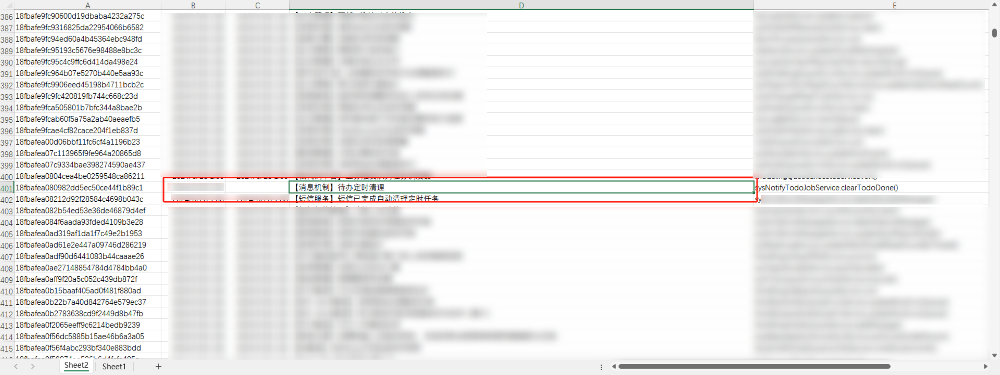
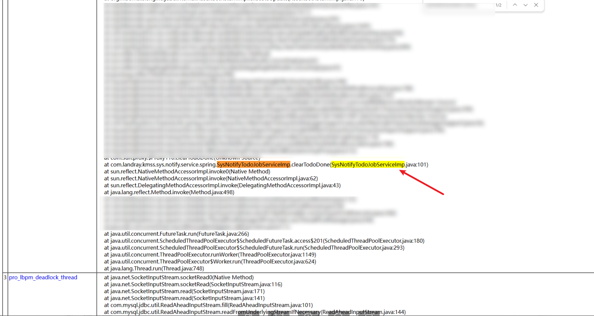
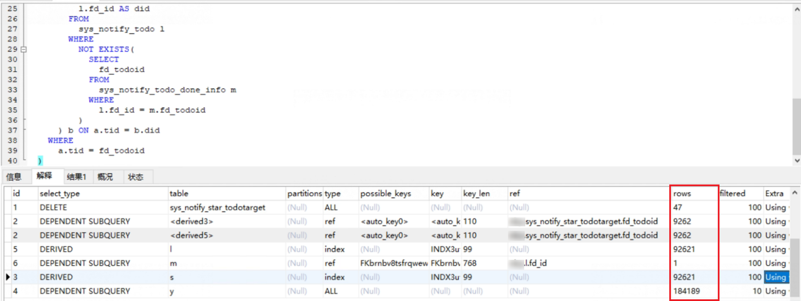
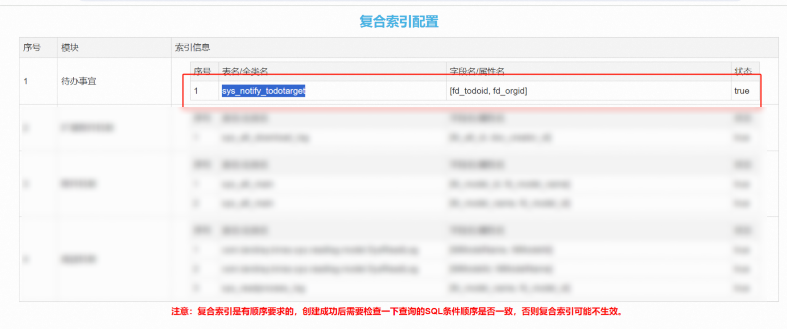
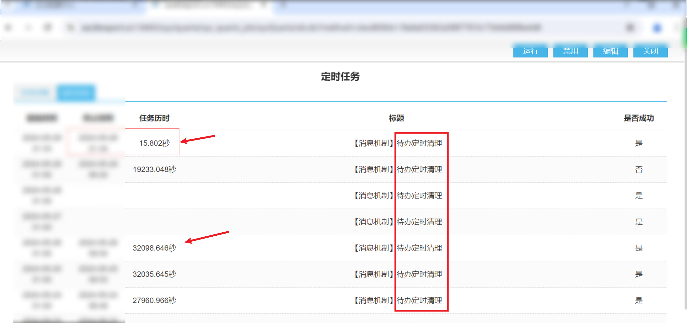

- 📝记录一下在实习遇到的一个线上Bug，整体排查解决链路（已脱敏）。
- 🤔为什么要写这一个总结呢？问题其实很简单，但是其中的排查步骤是值得思考的，如何将这次经验**抽象成通用的解决步骤，这个才是关键所在！**。

**省流版：因为一张表索引没有设置好，导致的后续一系列的问题！**

## 问题的发现

客户的工单：产品的xxx页面修改操作无法响应，卡死。

## 定位问题

出现这个问题，第一个需要查看的就是日志和监控系统，可是！项目没有部署监控和日志系统😢

紧急部署内部的监控工具

## 分析

### 监控日志分析

通过日志可以发现，在某个时间的时候开始出现锁超时问题其中，`xxx_todo`表被锁住了。在业务中该表对应着我们其中待办模块。


从上述日志得到的信息就是，**`xxx_todo`表被锁了**，该表对应的是待办模块，判断问题的方向为待办相关定时任务

### 定时任务日志分析

通过拉取数据，找到定时任执行记录，可以锁定到「消息机制」待办定时任务执行没有结果。



### 阻塞期间数据库分析

阻塞期间数据库分析，实时抓取阻塞sql，确认和待办删除业务相关，并且执行将近两个小时


### 线程分析

进行sql执行节点，获取线程快照，发现「消息机制」待办定时清理，正在运行



### 执行计划分析

既然已经找到了具体的阻塞sql，那么我们可以直接进行expalin进行分析。

这里贴出**脱敏后的SQL**，来解释一下这个sql的含义吧

1. `delete from sys_start`

   这个是一个删除操作，目的是从`sys_start`中删除满足某些条件的记录

2. `where exists (...)`

   这里使用了 exists 子句，它的作用是：如果 exists 内的查询返回任何记录，外部的删除操作就会执行。也就是说，如果某些条件的记录存在于子查询中，那它们对应的 `sys_start` 表的记录将被删除。

3. 子查询`a`

   只选取那些 在 `sys_todo` 表中没有关联记录 的 `fd_id`。换句话说，它找到那些在 `sys_todo` 表中存在，但在 `sys_todotarget` 表中没有匹配 `fd_todoid` 的记录。

4. 子查询`b

   只选取那些 在 `sys_todo_info` 表中没有关联记录 的 `fd_id`。换句话说，它找到那些在 `sys_todo` 表中存在，但在 `sys_todo_info` 表中没有匹配 `fd_todoid` 的记录。

5. 子查询a和b的连接

   这部分将子查询 `a` 和子查询 `b` 中找到的 `tid` 和 `did` 进行内连接，条件是 `a.tid = b.did`。因此，它会选出那些同时满足两者条件的 `fd_id`。

6. 总结

   这条 SQL 语句的作用是：从 `sys_start` 表中删除那些 `fd_todoid` 符合以下条件的记录

   这些记录在 `sys_todo` 表中有对应的 `fd_id`，但 不在 `sys_todotarget` 表中。

   同时，这些 `fd_id` 在 `sys_todo_info` 表中也 没有 对应的记录。

```sql
delete from sys_start
where exists (
  select a.tid
  from (
    select s.fd_id as tid
    from sys_todo s
    where not exists (
      select fd_todoid
      from sys_todotarget y
      where s.fd_id = y.fd_todoid
    )
  ) a
  inner join (
    select l.fd_id as did
    from sys_todo l
    where not exists (
      select fd_todoid
      from sys_todo_info m
      where l.fd_id = m.fd_todoid
    )
  ) b
  on a.tid = b.did
  where a.tid = fd_todoid
)
```

从执行计划和sql可以得知，扫描`sys_start`表进行数据筛查进行的是全表扫描，其他表关联字段需要进行所以扫描，可以发现确认`sys_todotarget`缺失索引



### 增加索引优化

更新完成后再次查看执行计划，并且进行测试






成功🏅

## 总结

> 即使一张表未添加索引的性能问题，也可能引起严重后果。排查链路很长，排查难度也很大。

**如果在项目中遇到类似的问题，你会如何着手处理？**

1. 问题复现初步分析与监控

   收集信息：首先，我会收集性能问题的相关信息，包括具体的症状（如响应时间过长、查询卡顿、系统无响应等）、发生时间、频率以及受影响的范围。

   监控工具能提供关键的指标，如CPU使用率、内存占用、数据库查询时间等。

2. 日志分析

   **日志分析是核心**，通过分析日志中的错误、警告等等定位到可能的瓶颈或者是故障点。

   其实日志分析我感觉是可难可简单的就是，如果遇到多因素交织情况下，性能问题往往不是由单一因素引起的，而是多个因素（如不优化的SQL、资源瓶颈、锁争用等）共同作用的结果，排查时需要考虑多个角度。**总结起来就是需要多总结经验**

3. 具体情况具体分析

   例如如果排查出是DB的问题，那么其实可以大致分为这几类

   查询性能、索引管理、锁争用、数据库的配置等
